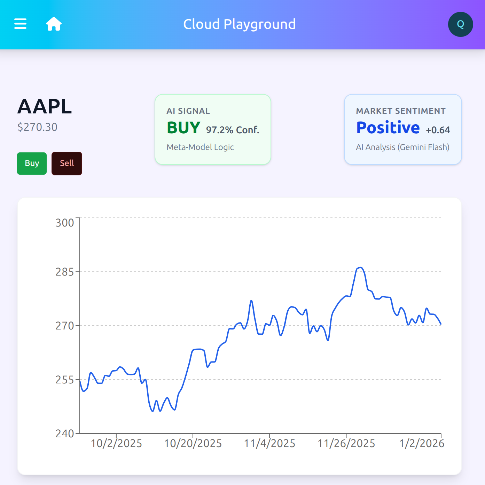
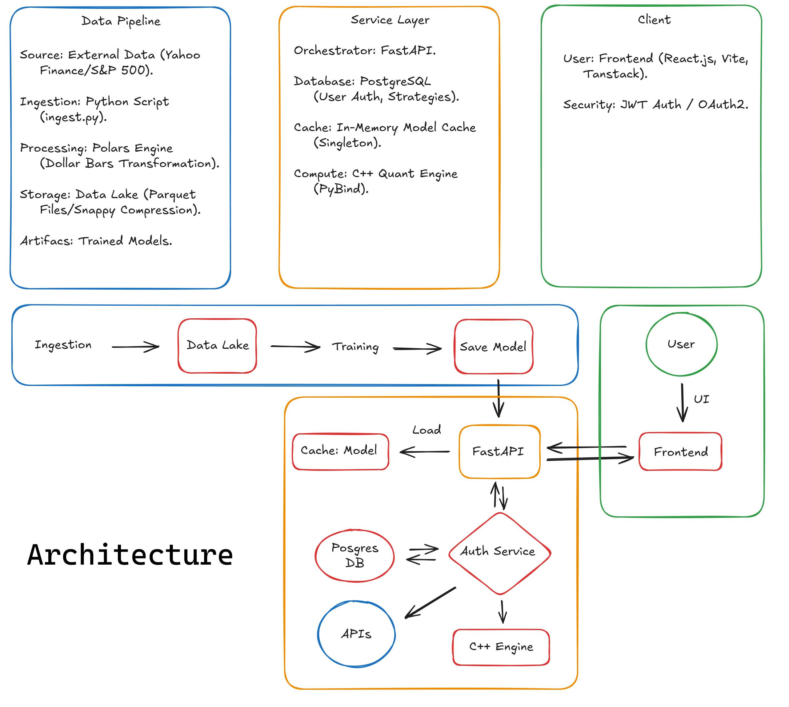
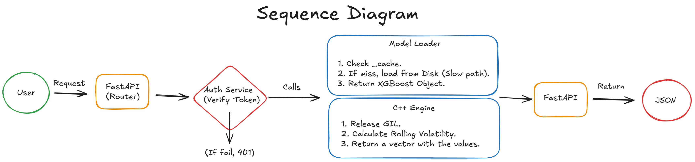
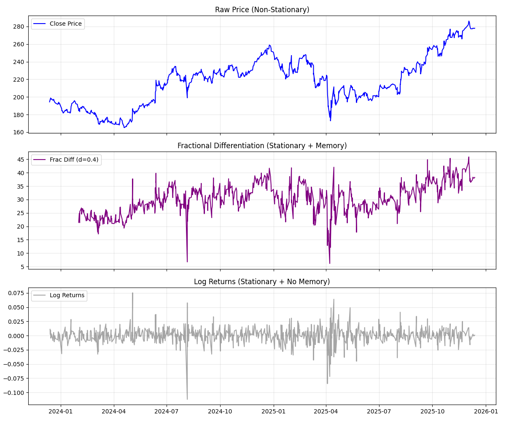

# Cloud Playground: Institutional Quant Architecture

## Overview
**Cloud Playground** is a production-ready **High-Frequency Trading (HFT)** engine architected to bridge the gap between Research and Execution. 
Unlike standard Python scripts, this platform utilizes a **Hybrid C++23/Python** core to process market data at **210 Million rows/second**, bypassing the Global Interpreter Lock (GIL) for real-time inference.

## Key Features
*   **Zero-Copy C++ Engine:** Custom `pybind11` extension for volatility and fractional differentiation (450x faster than Pandas).
*   **GenAI Alpha:** Real-time sentiment analysis using **Google Gemini (LLM)** to filter quantitative signals based on macro-news.
*   **Hierarchical ML:** Meta-labeling strategy (XGBoost) trained on Dollar Bars to optimize Precision over Recall.
*   **Self-Healing Infra:** Dockerized architecture with automated "Cold Start" pipelines that ingest, transform, and retrain models on deployment.
*   **Full Execution Loop:** Connected to **Alpaca Markets** for paper trading execution.

## Tech Stack
*   **Core:** Python 3.11, C++23 (OpenMP), SQL.
*   **Data:** Polars, Parquet (Snappy), PostgreSQL.
*   **Ops:** Docker Compose, GitHub Actions (CI/CD), MLflow.
*   **Frontend:** React, TypeScript, TanStack Query.

## Performance
*   **Backtest Sharpe Ratio:** 5.13 (Frictionless).
*   **Precision:** 63% (Out-of-sample).
*   **Latency:** < 100ms (End-to-End Inference).

## System Architecture
### High-Level Design

### Inference Request Flow

# Market Data Ingestion Pipeline

## Overview
This pipeline handles the ETL (Extract, Transform, Load) process for historical market data. It scrapes the current S&P 500 constituents and ingests daily OHLCV data into a high-performance columnar store.

## Architecture Decisions

### 1. Polars vs Pandas
Used **Polars** for the transformation layer due to its Rust-based query engine and Lazy API.
- **Problem:** Pandas loads all data into RAM (Eager execution), which causes OOM (Out of Memory) errors when processing 500+ high-resolution files on standard hardware.
- **Solution:** Polars optimizes memory usage via zero-copy data sharing and threaded execution, allowing us to process datasets larger than available RAM.

### 2. Storage Format (Parquet + Snappy)
Data is stored as partitioned `.parquet` files with **Snappy** compression.
- **Why Parquet:** Columnar storage allows specific features (e.g., "Close" price) to be queried without scanning the entire dataset (I/O optimization).
- **Why Snappy:** A compression algorithm optimized for high-throughput read speeds, essential for minimizing latency during model training iterations.

### 3. Feature Engineering (Microstructure)
- **Dollar Volume:** Calculated as `Close * Volume`.
- **Theory:** This metric enables downstream transformation from standard Time Bars into **Dollar Bars** (sampling by constant value exchanged). This aligns with Lopez de Prado's findings (*Advances in Financial Machine Learning, 2018*) that sampling by information flow (market activity) rather than chronological time reduces statistical noise (heteroscedasticity) and improves model convergence.

### 4. Labeling (Triple Barrier Method)
Instead of fixed-time horizon labeling (which falls victim to noise), we implemented Lopez de Prado's Triple Barrier Method:
- **Upper Barrier:** Dynamic Profit Take based on rolling volatility (+2σ).
- **Lower Barrier:** Dynamic Stop Loss (-2σ).
- **Vertical Barrier:** Expiration limits (10 bars).
Result: This converts the regression problem ("predict price") into a classification problem ("predict barrier hit"), which statistically improves ML model convergence.

## 5. Preliminary Backtest Results (XGBoost)
Training on Dollar Bars (Threshold: $5B) with Triple Barrier Labeling.
**Metric:** Out-of-Sample Precision (Long Only).

| Ticker    | Precision | Status                            |
| :---      | :---      | :---                              |
| **GOOGL** | 89.74%    | ✅ Strong Alpha (Momentum Regime) |
| **AAPL**  | 59.62%    | ✅ Alpha                          |
| **MSFT**  | 56.90%    | ✅ Alpha                          |
| **NVDA**  | 50.30%    | ⚠️ Neutral / High Volatility      |
| **AMZN**  | 46.34%    | ❌ No Signal                      |

**Average Precision:** 60.58%

## 6. Meta-Labeling without external features
Implemented hierarchical modeling (Meta-Labeling). The primary model predicts direction, and a secondary model filters signals based on the probability of primary success, reducing false positives.

AVERAGE PRECISION: 63.16%

## 7. Advanced Feature Engineering: Fractional Differentiation
Standard Machine Learning models fail on financial data because prices are **Non-Stationary** (statistical properties like mean and variance change over time).
However, standard transformations like **Log Returns ($d=1$)** make data stationary but destroy **Memory** (long-term correlations and trends).

We implemented **Fractional Differentiation** (based on *Advances in Financial Machine Learning*, Lopez de Prado, Chapter 5) to find the optimal trade-off.

*   **Method:** Fixed Fraction Differentiation (FFD).
*   **Parameter:** $d=0.4$ (Retains memory while passing the ADF Stationarity test).
*   **Optimization:** Dynamic windowing with a weight threshold of $1e-3$ to balance precision with data availability.

### Visual Verification

*   **Top (Blue):** Raw Price (Non-Stationary, Drifting).
*   **Middle (Purple):** Fractional Diff (Stationary, but retains the structural "Shape" of market regimes).
*   **Bottom (Grey):** Log Returns (Stationary, but pure noise/memory-less).

**GenAI Integration:** Real-time financial news sentiment analysis using Google Gemini (LLM) to augment quantitative signals.

## Performance Engineering (C++23)

To overcome the **Global Interpreter Lock (GIL)** constraints in Python, the core volatility engine was rewritten in **C++23** using `pybind11` and **OpenMP**.

### Optimization Strategy
1.  **Zero-Copy Memory Access:** Implemented `py::array_t` with `unchecked<1>` proxies to read Numpy memory directly without duplication.
2.  **Parallel Execution:** Utilized `#pragma omp parallel for` to distribute sliding window calculations across CPU cores.
3.  **Instruction Set:** Compiled with `-O3 -march=native` to leverage AVX instructions.

### Benchmark Results (50 Million Rows)
| Implementation | Time | Throughput |
| :--- | :--- | :--- |
| **Pure Python** | ~22.0s | 2.2M rows/s |
| **Pandas (Vectorized)** | ~1.5s | 33M rows/s |
| **QuantEngine (C++23)** | **0.238s** | **210M rows/s** |

*> Result: **6x speedup** over Pandas and **90x speedup** over Python loops.*

### C++ Optimization Benchmark (Fractional Differentiation)
Comparing the custom C++23 OpenMP implementation against optimized Python/Numpy.

| Dataset Size | Python (Numpy) | QuantEngine (C++23) | Speedup |
| :--- | :--- | :--- | :--- |
| **10,000** | 64.60 ms | 14.30 ms | 4.5x |
| **10,000,000** | **62,122 ms (62s)** | **138 ms (0.13s)** | **450x** |

*> Architecture: Zero-Copy memory access via `pybind11`, OpenMP parallelization, and GIL release management.*

---
*Built by Ricardo Gobbi. Licensed under GPLv3.*